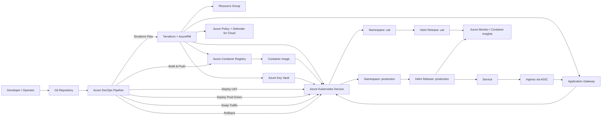

# Workflow Architecture Diagram

## Flow Summary

1. A developer pushes changes to the repository.
2. Azure DevOps runs Terraform plan and apply through approval gates.
3. Terraform provisions AKS, ACR, Key Vault, Application Gateway, Policy, and Defender settings.
4. The pipeline builds and pushes the application image to ACR.
5. Helm deploys the app into UAT and production namespaces on AKS.
6. Application Gateway, through AGIC, routes traffic to the workload.
7. Azure Monitor and Defender provide operational and security visibility.
