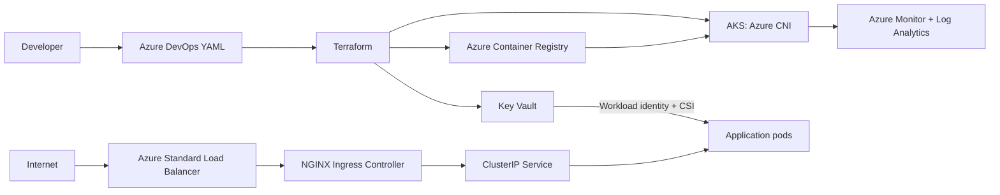

# AKS Production-Grade Practice

This repository is an end-to-end AKS learning project. It provisions Azure infrastructure with Terraform, builds an application container, deploys it with Helm through Azure DevOps, and exercises production operations such as blue-green releases, rollback, monitoring, and incident diagnosis.

## Architecture



The selected ingress path is **NGINX Ingress Controller exposed by an Azure Standard LoadBalancer Service**. Application Gateway and AGIC are not part of the active deployment path.

## Prerequisites

- Azure CLI, Docker, Terraform >= 1.6, kubectl, and Helm
- An Azure subscription and Azure DevOps project
- Permissions to create AKS, ACR, Key Vault, monitoring resources, and role assignments
- An Azure DevOps service connection and the `aks-practice-vars` variable group

## Setup

1. Run `./bootstrap-backend.sh` once to create the Terraform state storage.
2. Copy `infra/terraform.tfvars.example` to `infra/terraform.tfvars` and set the subscription, tenant, location, and `name_prefix`.
3. Set `alert_email` if you want the Terraform-managed AKS CPU alert to notify you.
4. Run `./deploy-infra.sh`, or use `infra-deploy.yml` after configuring the pipeline variables.
5. Capture Terraform outputs:

```bash
cd infra
terraform output
```

6. Set the generated ACR server, Key Vault name, tenant ID, and workload identity client ID in the Helm values or pipeline variables.
7. Build and push an image, then deploy with `app-deploy.yml` or:

```bash
helm upgrade --install aks-practice-app ./charts/aks-practice-app \
  --namespace production --create-namespace \
  --values charts/aks-practice-app/values-production.yaml \
  --set image.tag=1 \
  --set image.repository=<acr-login-server>/aks-practice-app \
  --set secretProvider.workloadIdentityClientId=<workload-identity-client-id>
```

The Key Vault secret named `tls-cert` must exist before the CSI volume can mount. The example uses a mounted file at `/mnt/secrets-store`; it does not copy the secret into a Kubernetes Secret. The application pipeline discovers the current Key Vault and workload identity values from the resource group and injects the tenant ID at deployment time.

Terraform enables the AKS Key Vault Secrets Provider addon with secret rotation. The application pipeline also enables the addon idempotently and waits for the `SecretProviderClass` CRD before installing the chart. If the cluster predates this setting, the pipeline can enable it before deployment.

## Deployment Exercises

- Deploy blue to UAT and production.
- Deploy green alongside blue and wait for readiness.
- Confirm the service selector before and after `./scripts/swap.sh production green`.
- Run `./scripts/smoke-test.sh production <ingress-ip>`.
- Roll back with `./scripts/rollback.sh production` and confirm the selector points to blue.
- Capture sanitized evidence with `./scripts/capture-evidence.sh production`.

The script creates command-output files for nodes, pods, Deployments, Services, Ingress, endpoints, NetworkPolicies, events, HPA, PDB, workload identity, and the CSI mount. Runtime screenshots should be captured from Azure DevOps and the Azure portal during your own run and stored separately from secrets.

## Monitoring Demonstration

Terraform always enables the AKS OMS agent and Log Analytics workspace. If `alert_email` is set, Terraform also creates an Azure Monitor action group and an AKS node CPU metric alert at 80% average over 15 minutes.

Use these demonstrations in Log Analytics:

```kusto
ContainerLogV2
| where TimeGenerated > ago(30m)
| where PodNamespace in ("uat", "production")
| project TimeGenerated, PodNamespace, PodName, LogMessage
| order by TimeGenerated desc
```

```kusto
KubePodInventory
| where TimeGenerated > ago(30m)
| summarize Restarts=sum(ContainerRestartCount) by Namespace, Name
| order by Restarts desc
```

In Azure Monitor, open the AKS resource and demonstrate Metrics for node CPU and memory, then pin the charts to a shared dashboard. In Alerts, show the `aks-node-cpu` alert rule, its action group, condition, and alert history. Record the screenshots and the corresponding command output in your evidence notes.

## Design Decisions and Tradeoffs

### Azure CNI vs kubenet and Azure CNI Overlay

This project chooses Azure CNI because pods receive Azure VNet IP addresses and can integrate directly with Azure networking and security controls. The tradeoff is higher VNet IP consumption and more subnet planning. Kubenet conserves VNet addresses but adds routing complexity and is less suitable when pods need direct VNet integration. Azure CNI Overlay reduces VNet IP pressure by using an overlay pod CIDR, but introduces an overlay boundary and should be selected when address scale matters more than direct pod addressing. No `network_plugin_mode` is set here, so this is traditional Azure CNI.

### NGINX vs Application Gateway

NGINX is selected here because it is Kubernetes-native, portable, and makes Ingress, Service, and NetworkPolicy behavior easy to practice. Application Gateway with AGIC would provide an Azure-managed Layer 7 entry point and tighter Azure integration, but changes the controller, identity, routing, and troubleshooting model. The documentation and pipeline intentionally describe only NGINX plus Azure LoadBalancer.

### Workload identity vs stored credentials

The Key Vault CSI path uses AKS OIDC workload identity and a user-assigned managed identity. No client secret is stored in Git, Helm values, or Kubernetes. The identity receives only the Key Vault Secrets User role on the project vault.

## Interview Talking Points

- Explain how Terraform modules separate AKS, ACR, Key Vault, and reusable infrastructure concerns.
- Explain why the pipeline publishes a Terraform plan artifact and applies that reviewed plan.
- Walk through image tagging, ACR push, Helm values, readiness checks, and promotion.
- Demonstrate blue-green traffic switching as a Kubernetes Service selector change.
- Explain how workload identity avoids static cloud credentials.
- Show how NetworkPolicy, RBAC, ResourceQuota, PDB, probes, and HPA improve resilience.
- Use a scenario to explain your diagnosis process: observe, inspect events/logs/metrics, isolate the cause, repair, and verify.
- Be explicit about what was deployed and what is a documented alternative: this repository deploys NGINX, not AGIC.

## Troubleshooting

Scenario scripts and diagnosis guides are in [scenarios](scenarios). Important checks include `kubectl describe`, `kubectl logs`, `kubectl top`, `kubectl auth can-i`, service endpoints, Ingress status, Azure Monitor metrics, and Log Analytics queries.

Destroy the practice environment with `./destroy-infra.sh` when it is not needed. Set `SUBSCRIPTION_ID`, `TENANT_ID`, and `BACKEND_STORAGE_ACCOUNT` first; the script destroys project resources but preserves the remote-state backend. The AzureRM provider is configured to allow this explicit Terraform destroy to remove nested resources in the project resource group.
